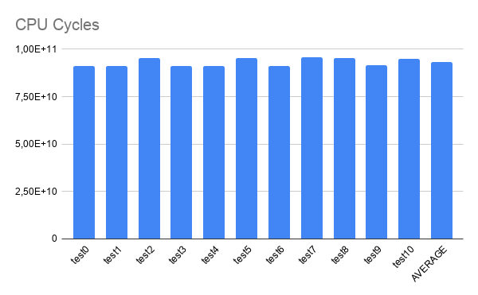
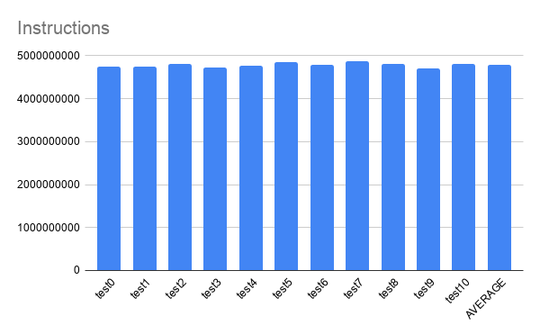
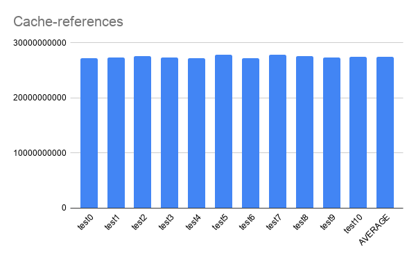
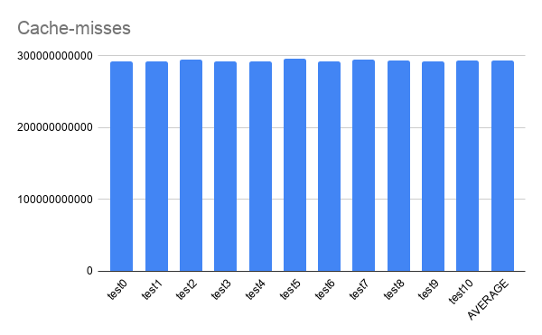
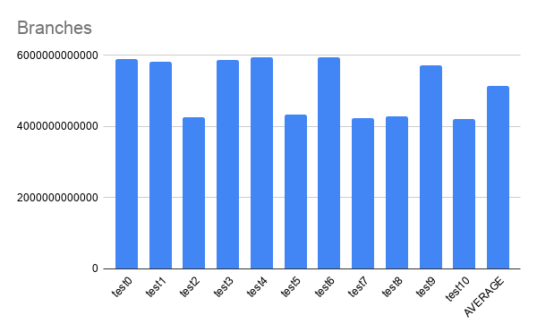
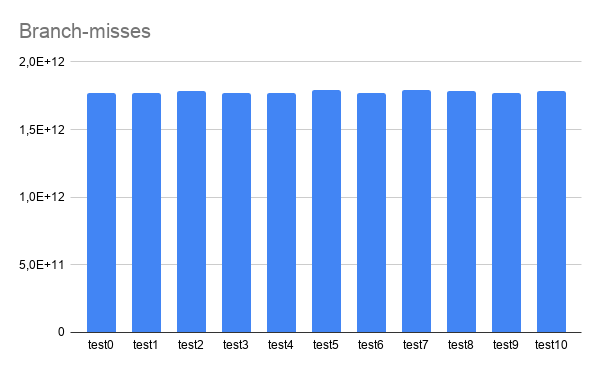
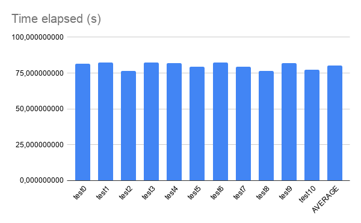
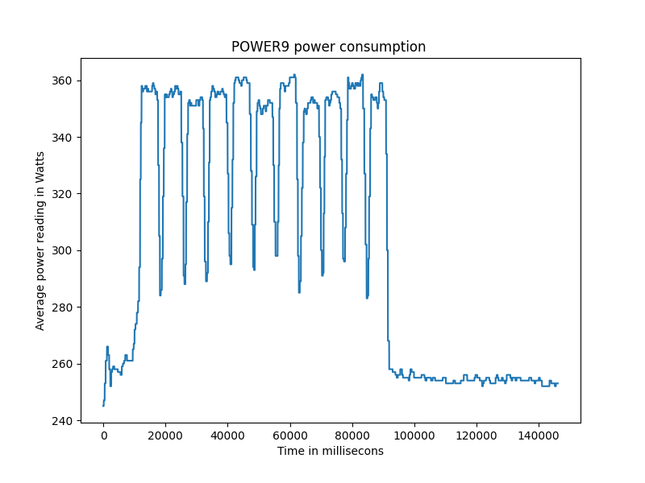

Although there is plenty information on AI profiling for x86_64 and ARM architectures, there is almost none on POWER.  

With that motivation in mind, this post aim to share some results on this subject.  

The program profiled was a python script that had a pre-trained ResNet50 with ImageNet weights, which was obtained from TensorFlow API.  
It aimed to classify 500 hot-dogs images downloaded from the ImageNet.  
The profiling was done using Perf for collecting PMU data and ipmitool for energy consumption data.  

Requirements for the pyhton script:
- Bare-metal machine
- ipmitool
- python 3.6
- TensorFlow 2.1.1  

Machine Stats:
- POWER9 Processor
- CPU(s): 128
- On-line CPU(s) list: 0-127
- Thread(s) per core: 4
- Core(s) per socket: 16
- Socket(s): 2
- NUMA node(s): 2
- Model: 2.2

You can find information on how to install TensorFlow on POWER in this post: <https://openpower.ic.unicamp.br/post/building-tensorflow-on-power/>
  
Eleven tests were executed.

```python
from tensorflow.keras.applications.resnet50 import ResNet50
from tensorflow.keras.preprocessing import image
from tensorflow.keras.applications.resnet50 import preprocess_input, decode_predictions
import numpy as np
import sys
import time
from datetime import datetime

begin = time.time()

#folder = sys.argv[1]
length = 731
length = int(sys.argv[1])
if (length > 731):
    print("Using maximum length: 731")
    lenght = 731
again = int(sys.argv[2])
folder_name = "hot_dog"

model = ResNet50(weights='imagenet')

images = []
count = 0
for i in range(length):
    img_path = folder_name + '/' + str(i) + '.jpg'  
    img = image.load_img(img_path, target_size=(224, 224))
    images.append(image.img_to_array(img))
    images[i] = np.expand_dims(images[i], axis=0)
    images[i] = preprocess_input(images[i])

for j in range(again):
    for i in range(length):
        prediction = model.predict(images[i])
        #print(decode_predictions(prediction[i], top=1)[0][0][1])
        strPrediction = decode_predictions(prediction, top=1)[0][0][1]
        if (strPrediction == 'hotdog'):
            count += 1
        else:
            #print(str(i) + " -> " + strPrediction)
            pass

print("Begin: " + datetime.utcnow().strftime("%H:%M:%S"))
print("End: " + datetime.utcnow().strftime("%H:%M:%S"))
print("RIGHTS: {}".format(count))
print("WRONGS: {}".format(again*length - count))
print("ACC: {}".format(count/(again*length)))
print("Time Elapsed: {}s".format(time.time() - begin))
```
Because the model is pre-trained, it obtained the same classification accuracy for every test.
```html
RIGHTS: 433
WRONGS: 67
```

### Profiling using perf.

Perf is a profiling program included with the Linux kernel. Here it was used to instrument CPU performance counters.  

PMUs used:  
```html
branches,
branch-misses,
cache-misses,
cache-references,
cycles,
instructions,
idle-cycles-backend,
idle-cycles-frontend.
```

The following graphs shows the data fetched from those PMUs.  
Graphs:  
CPU Cycles:  

Instructions:  

Cache-references:  

Cache-misses:  

Branches:  

Branch-misses:  

Time Elapsed:  


### Energy consumption.

Make sure you are running on a bare-metal machine.

How to use the ipmitool to get power consumption data:
Install ipmitool through:
```bash
sudo apt-get install ipmitool
```
Then run the command:
```bash
sudo ipmitool dcmi power reading
```

Which is going to give you the output:
```html

    Instantaneous power reading:                   262 Watts
    Minimum during sampling period:                248 Watts
    Maximum during sampling period:                263 Watts
    Average power reading over sample period:      257 Watts
    IPMI timestamp:                           Sun Nov  8 19:51:18 2020
    Sampling period:                          00000005 Seconds.
    Power reading state is:                   activated

```

This command was executed continuosly for 1500 seconds using a python script that would parse the results into a csv file.

Altough the sampling period was used for reference in order to plot the following graph, it does not represent an accurate time series in the x axis.
For a better undertanding of power consumption profiling on POWER with ML algorithms, see the following post: https://openpower.ic.unicamp.br/post/power-consumption-on-power/

That said, the data was used to plot the following graph:



It is possible to see the average of energy consumption for each test and, at the end, the energy consumption going back to a normal state.
It can also be observed that there is an increase close to 100W when a test begins to run.


