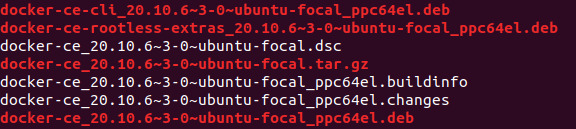
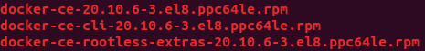

This blogpost aims to teach how to build and create a Docker .deb and .rpm packages starting from Docker 20.10 release, considering that since that version the Docker Engine and Docker CLI are built directly from the source repositories.  


## *Requirements*
We used Ubuntu 20.04 for this tutorial for both .deb and .rpm builds.  
First, make sure you have both *git* and the *make* package on your machine.  
You can install then with:
```bash
sudo apt install git
sudo apt install make
sudo apt install unzip
```
After that, we need to install Docker-CE. To do that, just add our POWER packages repository to your machine:  

Edit the file `/etc/apt/sources.list` by adding the following line:  

`deb https://oplab9.parqtec.unicamp.br/pub/repository/debian/ ./`

Download our [GPG key](https://oplab9.parqtec.unicamp.br/pub/key/openpower-gpgkey-public.asc), and use the command below to add it to the system:  
```bash
sudo apt-key add openpower-gpgkey-public.asc
```

After that, update the package list and install docker-ce:  
```bash
sudo apt update
sudo apt install docker-ce
```
More information about our repository in: [POWER Repository](https://openpower.ic.unicamp.br/project/power-repository/)

# Build and Packaging

We'll need to download docker-cli and moby (current name of the docker engine) and clone the repositories from scan-cli-plugin and docker-ce-packaging.  
Clone the following docker repositories:
```bash
git clone https://github.com/docker/scan-cli-plugin.git
git clone https://github.com/docker/docker-ce-packaging.git
```

Download the desired version (we'll use 20.10.6) of the cli and moby by downloading its releases (you can use `git clone` to build the master branch too):
```bash
# Download the cli source code and change its zip name
wget https://github.com/docker/cli/archive/refs/tags/v20.10.6.zip
mv v20.10.6.zip cli.zip

# Download the moby source code and change its zip name
wget https://github.com/moby/moby/archive/refs/tags/v20.10.6.zip
mv v20.10.6.zip moby.zip

# Unzip the downloaded source-codes
unzip cli.zip
unzip moby.zip

#Change the folders name
mv cli-20.10.6 cli
mv moby-20.10.6 moby
```

Because the Docker Build uses containerd.io, we need to modify two files on docker-ce-packaging in order to use the community version of the same software, which is probably already installed on your machine if you installed Docker-CE from our repository([POWER Repository](https://openpower.ic.unicamp.br/project/power-repository/)).  
Besides that

Modify the files with python3 by running the following script:  
```python
import re

print("Running Patching Script...")

deb_path = "docker-ce-packaging/deb/common/control"
deb_ver = "containerd (>= 1.2.1)"

rpm_path = "docker-ce-packaging/rpm/SPECS/docker-ce.spec"
rpm_ver = "Requires: containerd >= 1.2.1"

# Update debian containerd dependency
print("Patching DEB...")
deb = open(deb_path, 'r')
data = deb.read()
new = re.sub(r'containerd.io \([^)]*\)', deb_ver, data)
assert data != new, "Nothing was changed in the file."
open(deb_path, 'w').write(new)

# Update rpm containerd dependency
print("Patching RPM...")
rpm = open(rpm_path, 'r')
data = rpm.read()
new = re.sub(r'Requires: containerd.io [^\n]*', rpm_ver, data)
assert data != new, "Nothing was changed in the file."
open(rpm_path, 'w').write(new)

print("DONE Patching")
```

After the patch is done, we need to create specific folders inside `docker-ce-packaging` and copy the other cloned repositories into that folders.  

From the outside of *docker-ce-packaging*, do that with:
```bash
# Create the folders
mkdir -p docker-ce-packaging/src/github.com/docker/cli
mkdir -p docker-ce-packaging/src/github.com//docker/docker
mkdir -p docker-ce-packaging/src/github.com/docker/scan-cli-plugin

# Copy cli, moby and scan-cli-plugin
sudo cp -r cli/* docker-ce-packaging/src/github.com/docker/cli
sudo cp -r moby/* docker-ce-packaging/src/github.com/docker/docker
sudo cp -r scan-cli-plugin/* docker-ce-packaging/src/github.com/docker/scan-cli-plugin
```

## Making .deb packages
Systems available:  
**Ubuntu:**  
*ubuntu-buster, ubuntu-bionic, ubuntu-focal, ubuntu-groovy, ubuntu-hirsute, ubuntu-xenial*  
**Debian:**  
*debian-bullseye, debian-buster*  
**Raspbian:**  
*raspbian-bullseye, raspbian-buster*  

Make the packages with:
```bash
cd docker-ce-packaging/deb
sudo VERSION=20.10.6 make ubuntu-focal
```

They will be available at: `docker-ce-packaging/deb/debbuild/`  
In our example, the .deb files will be at  
`docker-ce-packaging/deb/debbuild/ubuntu-focal`  



## Making .rpm packages

Edit the file `docker-ce-packaging/rpm/gen-rpm-ver`  
by changing the characters `||` to `&&` in line 46  

Systems available:  
**CentOS:**  
*centos-7, centos-8*  
**Fedora:**  
*fedora-32, fedora-33, fedora-34*  
**RHEL:**  
*rhel-7*  

Make the packages with:
```bash
cd docker-ce-packaging/rpm
sudo VERSION=20.10.6 make centos-8
```

They will be available at: `docker-ce-packaging/rpm/rpmbuild/`  
In our example, the .rpm files will be at  
`docker-ce-packaging/rpm/rpmbuild/centos-8/SRPMS` and  
`docker-ce-packaging/rpm/rpmbuild/centos-8/RPMS/ppc64le`  



## *References*
Docker CLI: https://github.com/docker/cli  
Docker Engine: https://github.com/moby/moby  
scan-cli-plugin: https://github.com/docker/scan-cli-plugin  
Docker-CE Packaging: https://github.com/docker/docker-ce-packaging  
OpenPOWER@UNICAMP POWER Repository: https://openpower.ic.unicamp.br/project/power-repository/
