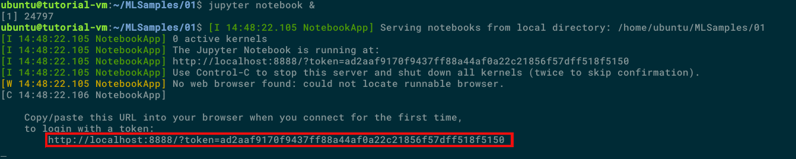
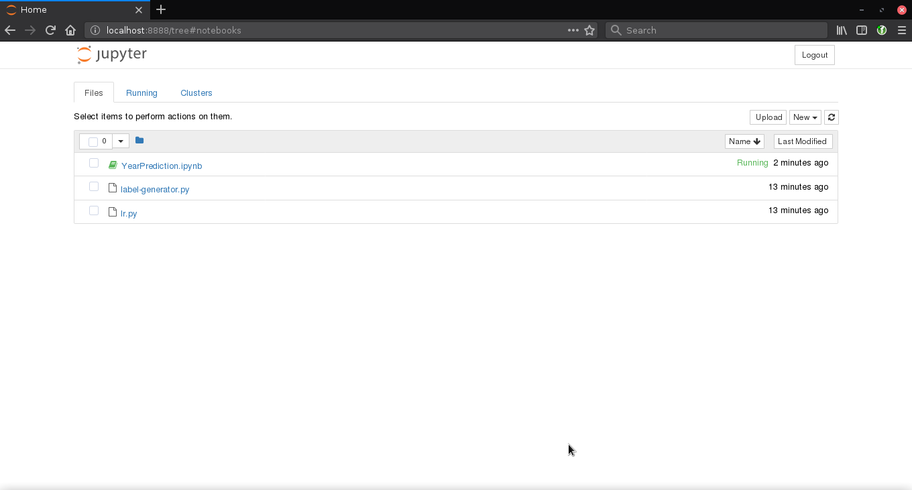

## Introduction and Prerequisites
In this tutorial I will show how to use Jupyter in your browser to control scikit-learn running inside a VM.
First of all you need build and connect to VM, which is showed in [this tutorial](https://github.com/Unicamp-OpenPower/minicloud/wiki/Getting-Started-with-Minicloud).

## SSH connection

Now you need connect to VM via ssh using `-L 8888:localhost:8888` flag, which will bind your computer port 8888 to port 8888 from VM:

`ssh ubuntu@minicloud.parqtec.unicamp.br -i ~/.ssh/your-key.pem -p <vm-port> -L 8888:localhost:8888`

## Instalation and executing

Now let's update O.S., then install jupyter and sklearn:
``` shell
   sudo apt update
   sudo apt upgrade -y
   sudo apt  sudo apt install jupyter python3-sklearn python3-pandas -y
```

Initiate jupyter notebook with `&` flag, which will allow jupyter run in backgroud:


## Results

Open link showed by jupyter on your favorite browser:


And now you are ready to use scikit-learn using jupyter remotely.
