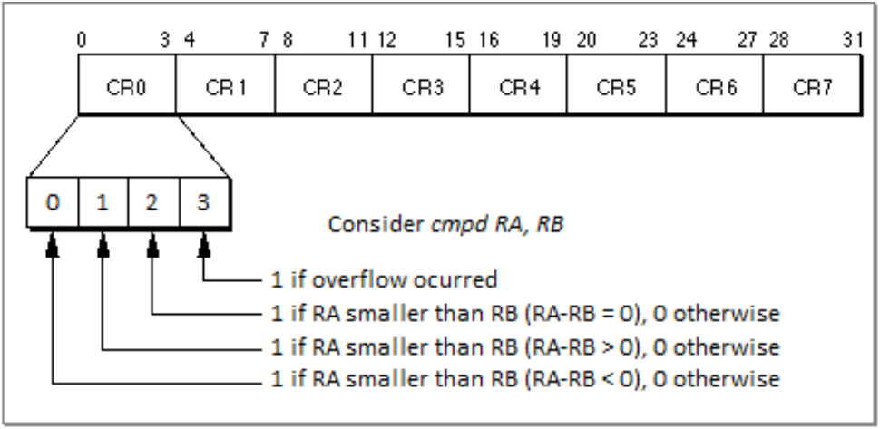

## Introduction

Usually, we let the compiler handle all the “C to Assembly” conversion, but there are certain losses in this automated process: poorly utilized special registers, unnecessary branching and memory accesses, among other issues. These details are insignificant when there are few occurrences during a program’s runtime, however, some sections of code can be executed over a billion times, and, if these sections ignore these details, it can amount to a significant performance overhead.
The inline assembly tool in C aims to avert some of these problems by delegating part of the assembling job to the programmer. The tool consists of a special function which receives a raw assembly code section written by the programmer, as well as some register constraints and qualifiers. This tool is mostly used in two scenarios: code optimization and OS/hardware services.

## Inline Assembly Basics:

### Syntax:
    asm [asm-qualifiers] ( 
            AssemblerTemplate 
            [  : OutputOperands 
            [ : InputOperands
            [ : Clobbers ] ] ]
        );

**Keyword “asm”:** The inline assembly function is called as asm(). There are [alternative keywords](https://gcc.gnu.org/onlinedocs/gcc/Alternate-Keywords.html#Alternate-Keywords) for “asm” since some compiler options might not recognize it. 

**Qualifiers:** These communicate to the compiler certain behaviors. They tend to be used when the compiler must be informed of something that occurs within the asm code for the program to function properly. The volatile qualifier, for instance, forces the compiler to not remove the asm section during the optimization stage, even if the section produces no outputs (which is quite common when interacting with OS/hardware services).

**Assembler Template:** This is the actual assembly code and the only mandatory parameter. Here we can pass one or more strings which will be concatenated and printed into the assembly file (file.s). Due to the concatenation, all instructions must be terminated with “\n” or “;”. The most common termination used is “\n\t” as it ensures the instructions are in separate lines and properly formatted with tabs.

**Output and Input Operands:** Both consist of a list with all the C variables which should be passed to the assembly code. The main difference is that input operands are not meant to be “written to” only “read from”, because the compiler considers that these values will not be altered during the assembly execution. Output operands, on the other hand, are expected to be modified, if they’re not, the compiler may exclude the asm call entirely as it can consider an asm call with no return value useless.

**Clobbers List:** It is a register list which may have it’s registers altered. Every register in the list will be avoided by the compiler when assigning registers for input/output operands. Useful when instructions implicitly change registers (compare instructions for instance). [More about Clobbers here](https://gcc.gnu.org/onlinedocs/gcc/Extended-Asm.html#Clobbers-and-Scratch-Registers).

### Operands Formats:
    
    Output: [ [asmSymbolicName] ] constraint (C_variable_name)
    Input:  [ [asmSymbolicName] ] constraint (C_expression)

**Symbolic Names:** Every input/output has a symbolic name by default which is defined by the operands index: the first element (indexed by 0) is the leftmost output operand, the last, is the rightmost input operand. The N-th operand can then be referenced with `%N`, where N is it’s index. A custom symbolic name can be defined in the operands list and reference by using `%[asmSymbolicName]` within the template.

**Constraints:** Every input/output operand must have a constraint which, as the name implies, constrains the contents and location of an operand as well as it’s access. Since the idea is to leave the least amount of work possible for the compiler, using them can be helpful. Constraints can be generic or machine specific, [there’s a whole list of these](https://gcc.gnu.org/onlinedocs/gccint/Constraints.html).

*Figure 1 - Input and Output Operands naming conventions.*

***Note:*** *You can check out some PowerPC asmexamples [here](https://www.ibm.com/support/knowledgecenter/SSGH3R_16.1.0/com.ibm.xlcpp161.aix.doc/language_ref/asm_example.html#asm_example__Example5TheFollowingExampleShowsTh-027B19F3).*

## Max Element With Inline Assembly
As for a practical example, let’s create an *asm* call that finds the maximum value within an integer array.

### The Code:

    int asm_max (int vec[], int size) {
        int max=0;
    
        __asm__(
        "mtctr %[size]\n\t"           // Load value to SPR Counter Register
        "subi  %[vec], %[vec], 4\n\t" // Load first element and update
        "loop:\n\t"
        "lu 4, 4(%[vec])\n\t"         // Load Word and Zeros with update
        "cmpd 4, %[max]\n\t"          // Compare 
        "blt skip\n\t"                // skips update if less than
        "addi %[max], 4, 0\n\t"       // Updates maximum
        "skip:\n\t"
        "bdnz loop\n\t"           // Branch and Decrement CTR if CTR Not Zero
        : [max]"+r"(max), [vec]"+r"(vec)
        : [size]"r"(size)
        : "ctr", "cr0", "r4"
        );
    
        return max;
    }

The *asm_max* function is a wrapper which receives two parameters: an integer array (*vec*), and it’s *size*. The asm will be responsible for returning the maximum value within *vec* and assigning it to the return variable *max*.

***Note:*** *Isolating the asm call within another function can be helpful to prevent registers from being unintentionally overwritten. Ideally, this should be avoided, as the function call creates an overhead affecting overall performance. The correct use of the operands list should suffice.*

### Special Registsers Overview:

Before we start dissecting the code, let’s take a look at two special purpose registers used (CTR and CR) as well as some specific instructions (mtctr, cmpd, blt and bdnz).

**Special Purpose Registers:** The Condition Register (CR) holds the results of comparisons. It consists of 8 bitfields (blocks of 4 bits) that can be individually accessed through indexes, also, it can be implicitly altered when the cmp instruction is called. The Counter Register (CTR) is mainly used for loops. Besides being an integer counter, it has special instructions to facilitate assertions (CTR==0? or CTR!=0?) and incrementation/decrementation.

*Figure 2 - Condition register bitfield diagram*

**More About Comparisons:** The compare instruction is actually a subtraction that identifies if the result is negative, zero or positive. For example, if we have “cmpd A, B”, the operation realized is “A-B”. If the result is negative, the bit 0 of bitfield X is set. if 0, the bit 1of bitfield X is set. If positive, bit 3 is set. So, if we want to branch when ”A<B” we can use blt (checks if bit 0 from *bitfield* 0 is set). Note that the order of the registers A and B is paramount.

**Mnemonics:** Many instructions depend on certain unintuitive parameters to behave as we want them to. The cmp instruction (cmp BF, L, RA, RB), for example, needs parameters to define if it will compare 32 (L=0) or 64 (L=1) bits, and in which bitfield the result of this comparison will be kept (BF=[0-7]). The goal of mnemonics is to facilitate the use of assembly instructions (or sometimes just to shorten them) by adding intuitive synonyms to the instruction set.
Example: Let’s suppose we want to compare RA and RB, both with doublewords (64 bits), and save the result in the bitfield 0 of the CR register.  The standard instruction to do so would be “cmp 0, 1, RA, RB”, where 0 indicates the bitfield and 1 the fact that we are comparing doublewords. Alternatively, we can use the mnemonic (or synonym) “cmpd RA, RB”, which stands for Compare Doubleword. Note that there’s no bitfield defined in the latter, this is because it implicitly uses the bitfield 0. 

***Note:*** *Defaulting to the bitfield 0 or 1 is actually quite common among mnemonics, because we usually only work with one comparison at a time. The bitfield 0 is implicit if it’s an integer comparison, if it’s a floating point comparison, bitfield 1 is implicit.*

### Summing it up:
* **cmpd** - Compare Doubleword (and implicitly set result to CR’s bitfield 0)
* **mtctr** - Move to counter register (equivalent to mtspr 9, Rx) 
* **blt** - Branch if Less Than in bitfield 0 (equivalent to bc 12, 0, Label)
* **bdnz** - Branch and Decrement if Not Zero (equivalent to bc 16, 0, Label)
* **lu** - Load Word and Update (equivalent to lwzu)

### The ASM Operands List:
    : [max]"+r"(max), [vec]"+r"(vec)
    : [size]"r"(size)
    : "ctr", "cr0", "r4"

First, let’s uderstand what's happening here. We have max and vec as outputs* constrained by “+r” which mark them as read and write (+) and maps them to general purpose registers (r). As for input operands, we have the variable size as read only (it’s the default for input operands) and mapped to a general purpose register as well (r). 
When defining clobbers, we set the two SPRS discussed previously (CTR and CR) as these are altered during the code’s execution. In particular, CR has the index “0” appended to it, indicating that only the bitfield 0 will be used. The R4 register is also added to the list since it is used as an auxiliary variable in the code and should be avoided by the compiler. 

****Note:*** *In this case, vec is technically not an output, as it shouldn’t be altered. But, since it’s a copy made by the wrapper function, we do not need to worry about modifying its contents and will use it as an index for iterating through the array.*

### The ASM Code:
    1   "mtctr %[size]\n\t"           // Load value to SPR Counter Register
    2   "subi  %[vec], %[vec], 4\n\t" // Load first element and update
    3   "loop:\n\t"
    4   "lu 4, 4(%[vec])\n\t"         // Load Word and Zeros with update
    5   "cmpd 4, %[max]\n\t"          // Compare 
    6   "blt skip\n\t"                // skips update if less than
    7   "addi %[max], 4, 0\n\t"       // Updates maximum
    8   "skip:\n\t"
    9   "bdnz loop\n\t"            // Branch and Decrement CTR if CTR Not Zero

Finally, let’s understand the code. In the very first line, we set the value of the CTR as the size of the vector, which will make it easier to iterate through the vector. The second line is a bit confusing: since the lu instruction first increments the given address and then access it, we decrement the base address of the array in order to make sure it will start from the first element and not the second (kinda like starting at position -1 and always incrementing before reading). Alternatively we could load the first element in the max variable and exclude the second line, but if so, the code would have to be adjusted to work with arrays of a single element, and the CTR might need to be treated differently depending on how the first element is loaded (if we use lu, the CTR value should be size-1 to not exceed the array’s length).
The loop label indicates the start of our iteration through the array. The first step in the loop is to update* our index [vec] and load the next element in R4. Here, the value 4 indicates the amount to add to the current address so we can access the next index*. On line 5 we compare the next element to the current maximum**. If the element is smaller than the maximum, we simply skip the update, otherwise the addi instruction is executed adding 0 to the new maximum and updating [max]’s value. The last instruction in the loop is bdnz, which will first decrement the CTR and then check if it hasn’t reached zero. If CTR is not zero, the loop is executed again, otherwise, the asm terminates. 

****Note:*** *it computes in bytes. Since we have an integer array, which is four bytes per element, to access the next position we must add 4 bytes to the current address [vec].*

## Conclusion

The C Inline assembly tool allows us to quickly integrate assembly code with high level code, which allows for certain optimizations based on the processor's architecture as well as access to specific OS/Hardware services. Despite being useful, it’s a delicate tool which alters the assembly code by the programmer's orders, meaning that, if the parameters are not carefully checked, it could affect the program's cohesion by messing with register allocations. If this is the case, the code’s correctness/consistency would likely be broken rendering it useless.

## Anecdotes on Inline ASM

#### Counter Register and Mnemonics: 
The major advantage the CTR provides is the ease of executing loops with counters in assembly. This ease is provided mainly by mnemonics which can modify, compare and branch all in single instruction (in our case bdzn). You can check other mnemonics on Appendix C (page 790) of [the official Power ISA](https://ibm.ent.box.com/s/1hzcwkwf8rbju5h9iyf44wm94amnlcrv).

#### Labels Duplicates:
When talking about the asm call, I commented on the fact that the assembly code is literally concatenated and pasted to the assembly file generated by the compiler. Now suppose your code has multiple sections using asm calls and these sections all have the label loop or skip in it. In this case, when the asm is pasted to the file, there will be multiple labels with the same name and the compiler will point to  a conflict of addresses. The asm call allows you to define relative branches, but it’s quite limited: it only works if the labels are numerals, and it can only branch to the first label above or below the branching instruction. To use this tool you can add the suffixes b (backward) or f (forward) to the label’s name when branching. More about it [here](https://www.ibm.com/developerworks/rational/library/inline-assembly-c-cpp-guide/index.html).

#### Branching Prediction:
Many architectures implement an optimization called branching prediction. As the name implies, it considers that a certain branch instruction will or won’t be executed and optimizes the code by preprocessing some steps of the branch procedure. This can be relevant when a comparison is executed multiple times in some iteration and its outcome is almost always the same. The prediction can be implied in assembly language by appending the ‘+’ (probably will branch) and ‘-’ (unlikely to branch) symbols to the branching instruction. More about it [here](https://www.ibm.com/developerworks/library/l-powasm3/index.html).

#### Multi-Arch Programs: 
In case you’re not aware, assembly instructions are architecture dependent (meaning they might not be the same for different processors). In case you’re trying to implement come assembly code for a multi-arch software, you’ll need to be able to identify the machine’s architecture the program is being executed on. For this scenario we can use predefined compiler macros, such as `__powerpc64__`. With these macros we can chose to compile certain blocks of code using C compiler directives (Ex: `#IF DEFINED  __powerpc64__`) or use an if-else statement to choose between asm blocks.
