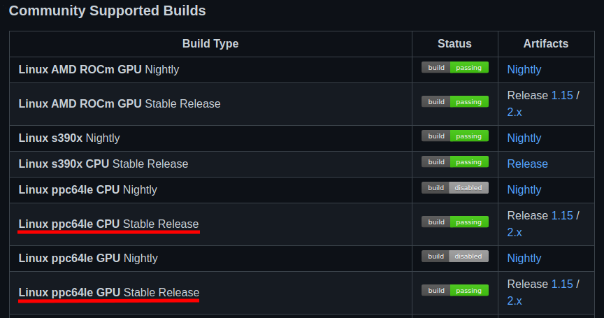
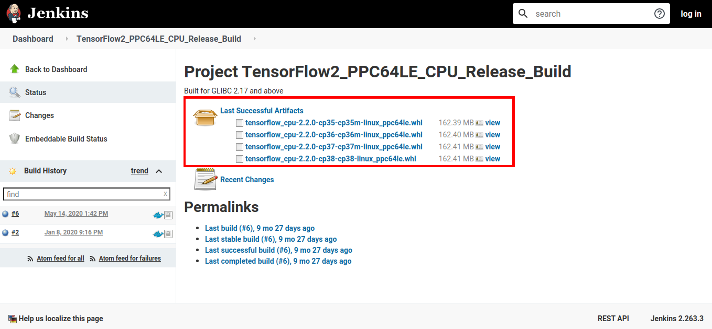

TensorFlow is a very popular open-source library for Machine Learning and in this post we will see two ways (from a Community Supported Build and from the IBM Watson Machine Learning Community Edition) of installing it on POWER.  


## *Installing TensorFlow from the Community Supported Build*
On the TensorFlow repository README on GitHub (https://github.com/tensorflow/tensorflow) there is a list of community builds of TensorFlow, in which includes CPU and GPU builds for POWER.  
    
We will be using the links available on there to install TensorFlow on POWER.

### Before Installation
Install the build-essential package with:
```bash
sudo apt-get update
sudo apt-get install build-essential
```

### Download and Install Anaconda package manager:  
We'll use Anacona to install TensorFlow within a virtual environment.

Download: https://www.anaconda.com/products/individual  
Remember to check the script sha256sum: https://docs.anaconda.com/anaconda/install/hashes/  

To install Anaconda Individual Edition, you just need to run the script downloaded and follow the inscructions that it provides.

Create Virtual Environment and activate it:  
```bash
conda create --name tf_env python=3.6 
conda activate tf_env 
```

We'll be using python3.6 for this environment installation.

To install Anaconda Individual Edition, you just need to run the script downloaded and follow the inscructions that it provides.

### Download and Install a TensorFlow build: 
The Community Supported Builds from TensorFlow repository README provides both TF Release 1.15 and 2.x versions for both CPU-only and GPU.  
  
In this tutorial we will be installing a 2.x CPU-only version, altough the same process can be use for the GPU version.  

1. Access https://github.com/tensorflow/tensorflow and select the needed build.  
We'll use the Release 2.x CPU (https://powerci.osuosl.org/job/TensorFlow2_PPC64LE_CPU_Release_Build/)  



2. Download the needed version and pay attention to the requirements (for instance, our selected build was built for GLIBC 2.17 and above).  
We'll download the cp36 version, since we created a virtual conda environment for python 3.6.  



3. After the .whl file was downloaded, we'll install it with pip within our conda environment.  
## Attention
When installing TensorFlow, it is possible that some requirements errors occurs. If that happens, just install the missing library and try instaling TensorFlow again.

For intance, we needed to install scipy 1.4.1 and h5py before the installation succeeded, and that can be done with Anaconda with the following commands:
```bash
conda install -c conda-forge scipy=1.4.1
conda install -c conda-forge h5py
```

Installing TensorFlow from the .whl file with pip inside the conda environment:
```bash
pip install tensorflow_cpu-2.2.0-cp36-cp36m-linux_ppc64le.whl
```

After the installation is completed, check TensorFlow within a python shell with:
```python3
import tensorflow as tf
print(tf.__version__)
```

## *[ALTERNATIVE] Installing TensorFlow with Watson Machine Learning Community Edition*
IBM Watson Machine Learning Community Edition also provides a TensorFlow installation through Anaconda, which will be taught in this tutorial.

### Download and Install Anaconda package manager:  
Download: https://www.anaconda.com/products/individual  
Remember to check the script sha256sum: https://docs.anaconda.com/anaconda/install/hashes/  
To install Anaconda Individual Edition, you just need to run the script downloaded and follow the inscructions that it provides.
### Add WMLCE Channel to Anaconda
After the installation, add WMLCE (IBM Watson Machine Learning Community Edition) channel:
```bash
conda config --prepend channels \ 
https://public.dhe.ibm.com/ibmdl/export/pub/software/server/ibm-ai/conda/
```
Create an Anaconda Python3.6 environment for WMLCE and activate it:
> Currently (09/2020) WMLCE only works with python version 3.6
```bash
conda create --name wmlce_env python=3.6 
conda activate wmlce_env 
```
### Install TensorFlow
For CPU-only use, install TensorFlow with:
```bash
conda install tensorflow
```
For GPU use, install TensorFlow with:
```bash
conda install tensorflow
```

TF is now installed and ready for use.

## Reference:  
Anaconda:  
https://www.anaconda.com/products/individual  
TensorFlow GitHub repository:  
https://github.com/tensorflow/tensorflow  
IBM Watson Machine Learning Community Edition:  
https://www.ibm.com/support/knowledgecenter/SS5SF7_1.6.1/navigation/welcome.html  
WMLCE softwares list:  
https://www.ibm.com/support/knowledgecenter/SS5SF7_1.6.1/navigation/wmlce_software_pkgs.html  
