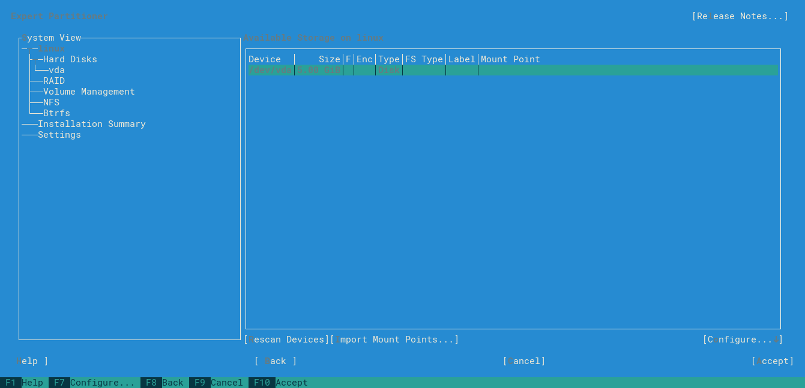
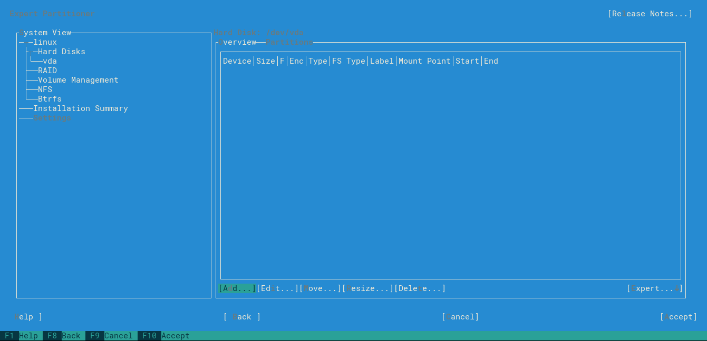
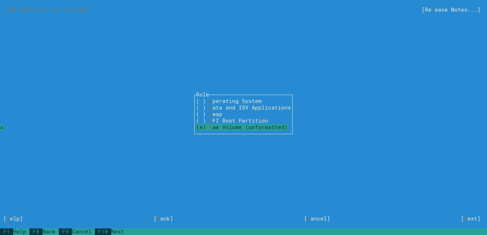
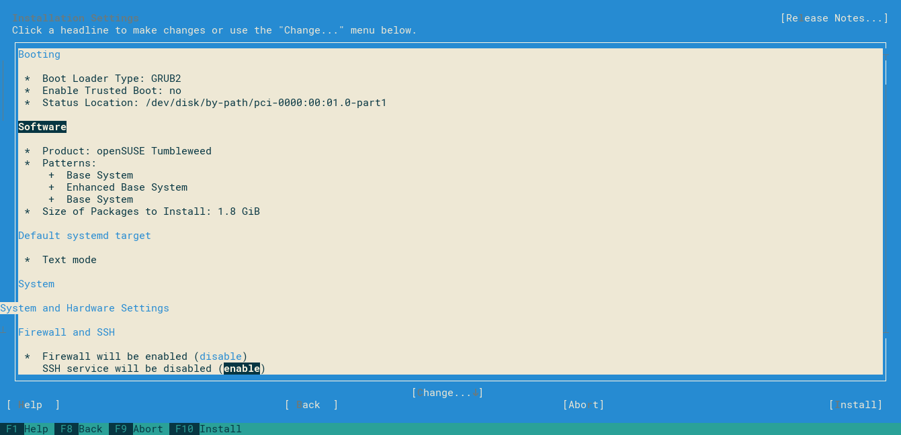

This tutorial I will show how create a openstack image (.qcow2) of opensuse from a ISO image using qemu.
In this tutorial will be used opensuse Tumbleweed ppc64 le (because it's the most challenging), but similiar process can be done for leap (15 and 42.3) and Tumbleweed ppc64be.

## Preparing environment

First we need download opensuse image from repository ([Tumbleweed](https://software.opensuse.org/distributions/tumbleweed), [ leap 15](https://oplab9.parqtec.unicamp.br/pub/ppc64el/opensuse/) and  [leap 42.3](http://download.opensuse.org/ports/ppc/distribution/leap/42.3/iso/)) and sha256 of respective image.

Execute sha256:
```bash
sha256sum openSUSE-Tumbleweed-DVD-ppc64le-Current.iso
```

Compare sha256sum output with sha256 downloaded:
```bash
715d9f89d90eb795b6a64ffe856aa5b7f3a64c7195a9ede8abea14a9d4f69e67
```

Install qemu using:
```bash
sudo apt update
sudo apt install qemu-kvm libvirt-clients libvirt-daemon-system -y
```

Now we need create a disk .qcow2 to install our O.S. with this command:
```bash
qemu-img create -f qcow2 openSUSE-Tumbleweed-ppc64le.qcow2 5G
```
>*Update 09/2020*: this comand above may cause problems try this command:
```bash
qemu-img create -f qcow2 openSUSE-Tumbleweed-ppc64le.qcow2 6G
```

Execute qemu to run the instaler:
```bash
sudo qemu-system-ppc64le -enable-kvm -m 1024 -cdrom openSUSE-Tumbleweed-DVD-ppc64le-Current.iso -drive file=openSUSE-Tumbleweed-ppc64le.qcow2,media=disk,if=virtio -nographic -smp cores=1,threads=1 -monitor pty -serial stdio -nodefaults -netdev user,id=enp0s1 -device virtio-net-pci,netdev=enp0s1 -boot order=d
```
>*Update 09/2020*: this comand above may not work, try this command:
```bash
sudo qemu-system-ppc64le -machine cap-htm=off -m 1024 -cdrom openSUSE-Tumbleweed-DVD-ppc64le-Current.iso -drive file=openSUSE-Tumbleweed-ppc64le.qcow2,media=disk,if=virtio -nographic -smp cores=1,threads=1 -monitor pty -serial stdio -nodefaults -netdev user,id=enp0s1 -device virtio-net-pci,netdev=enp0s1 -boot order=d
```

## Installing openSUSE

Select your language (using tab and arrows):

> Figure 1: Language selection screen


Select te most suitable bundle for your goal:

> Figure 2: Bundle selector screen


Select expert partitioner:


> Figure 3-4: Partioner selection screen


Select the hard drive that you want install opensuse:

> Figure 5: Drive selector screen


Add new partition selecting `add` button:

> Figure 6: Partition screen


Set `partition size` to `8 MiB`:

> Figure 7: Partition size screen (Boot)


Select `raw partition`:

> Figure 8: Partition role screen (Boot)


Select file system as `Ext4` (or other filesystem of your preference):

> Figure 9: File System type (Boot)


Select partition as `PReP Boot Partition` and `next`:

> Figure 10: Partition type (Boot)


The boot partition was create and now we will create O.S. partition, select `add` and inside Patition size screen select `Maximum Size`:

> Figure 11: Partition size screen (O.S)


Select `Operating System` option:

> Figure 12: Partition role screen (O.S)


Select file system as `Ext4` again (or other filesystem of your preference):

> Figure 13: File System type (O.S)


Left selected `Linux Native`:

> Figure 14: Partition type (O.S)


Left `Mount device` as `/` and select `next`:

> Figure 15: Mount point


Partition configuration will look like this:

> Figure 16: Final partion configuration


We will receive warning message but we can ignore it and select `yes`:

> Figure 17: Warning message


`Next` again:

> Figure 18: Sumary partition screen


Select your clock and time zone:

> Figure 19: Clock and time zone screen


Put you username and password:

> Figure 20: Local user screen


Accept instalation and install:

> Figure 21: Summary screen


> Figure 22: Instalation screen


## Preparing image

Update all packages and install necessary ones (you can also uninstall unnecessary packages):
```bash
sudo zypper update
sudo zypper install cloud-init growpart yast2-network yast2-services-manager acpid
```

Remove hard-coded MAC address:
```bash
sudo cat /dev/null > /etc/udev/rules.d/70-persistent-net.rules
```

Enable ssh and cloud-init:
```bash
sudo systemctl enable cloud-init
sudo systemctl enable sshd
```

Disable firewall:
```bash
sudo systemctl stop firewalld
sudo systemctl disable firewalld
```

Inside `/etc/default/grub` file, set grub timeout to 0:
```
GRUB_TIMEOUT=0
```


> Figure 23: Grub configuration


Update grub:
```
sudo exec grub2-mkconfig -o /boot/grub2/grub.cfg "$@"
```

## Only for openSUSE Tumbleweed Le/Be

Opensuse Tumbleweed ppc64 Le/Be lacks some parameters on cloud-init.service, this causes instability on boot, which, sometimes, causes network connection errors. This problem was [reported](https://bugzilla.opensuse.org/show_bug.cgi?id=1111441) and hopefully will be solved when you read this tutorial.

Edit `cloud-init.service` file:
```bash
sudo vim /etc/systemd/system/cloud-init.target.wants/cloud-init.service
```

Add lines bellow after `After=systemd-networkd-wait-online.service` line:
```bash
Requires=wicked.service
After=wicked.service
After=dbus.service
Conflicts=shutdown.target
```

> Figure 24: Configuration of cloud-init.service

Reload cloud-init service:
```bash
sudo systemctl restart cloud-init
sudo systemctl daemon-reload
```

Because Leap 42.3 ppc64Le's configuration fits better for a cloud role, so we will replace cloud.cfg of Tumbleweed by Leap42.3's cloud.cfg:
```bash
sudo vim /etc/cloud/cloud.cfg
```



## Cleaning image

Now delete all remaining data:
```bash
cat /dev/null > ~/.bash_history && history -c && sudo su
cat /dev/null > /var/log/wtmp
cat /dev/null > /var/log/btmp
cat /dev/null > /var/log/lastlog
cat /dev/null > /var/run/utmp
cat /dev/null > /var/log/auth.log
cat /dev/null > /var/log/kern.log
cat /dev/null > ~/.bash_history && history -c && sudo poweroff
```

## Adding to openstack

And finaly add image to openstack:
```bash
glance image-create --file openSUSE-Tumbleweed-ppc64le.qcow2 --container-format bare --disk-format qcow2 --property hw_video_model=vga --name "openSUSE Tumbleweed ppc64le"
```
If all the steps worked, you should see these messages at the next boot.

> Figura 25: Boot
