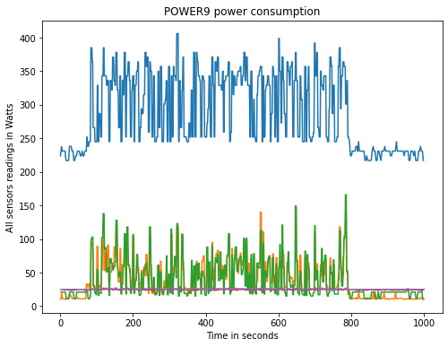
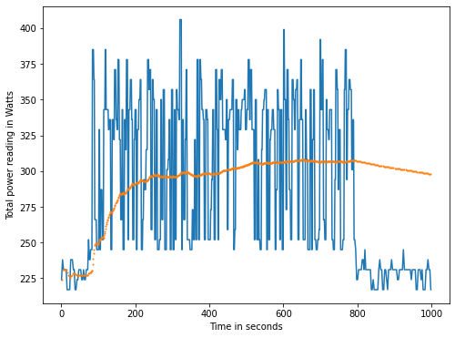
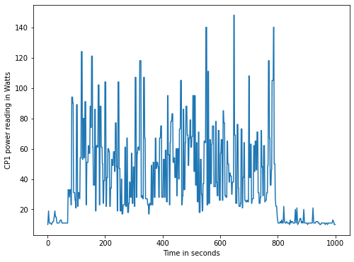
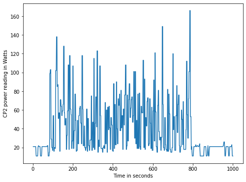
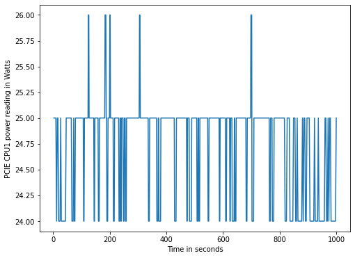
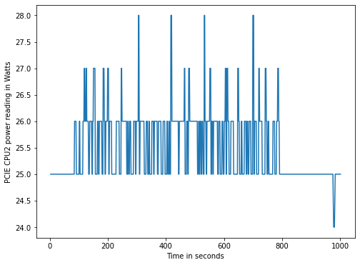

In this post, we will show how to get data on power consumption in a POWER9 bare-metal machine and how to plot this data using python.  

To measure the power consumption, a program called ipmitool will be used, once it give us the access to ipmi sensor data.  
  
In order to get a good span of values, a Image Classification script was used, which its code and execution procedure can be found here: https://openpower.ic.unicamp.br/post/ai-profiling-for-power/

## Using ipmitool to get sensors data  

In order to get a list of IPMI sensors, use the following command.  

Command: `sudo ipmitool sensor list`
Output fields meaning with example:
| Sensor ID | Sensor Reading | Sensor Reading Unit | Status | Lower Non-Recoverable | Lower Critical | Lower Non-Critical | Upper Non-Critical | Upper Critical | Upper Non-Recoverable |
|-----|-----|-----|-----|-----|-----|-----|-----|-----|-----|
| CPU1 Temp | 34.000 | degrees C | ok | 5.000 | 5.000 | 10.000 | 88.000 | 90.000 | 92.000 |

To get a single sensor data, use the command:  
`ipmitool sensor get <Sensor ID>`  
  
Example:  
`sudo ipmitool sensor get CPU1\ Temp`  
```bash
Locating sensor record...
Sensor ID              : CPU1 Temp (0xb)
 Entity ID             : 65.1
 Sensor Type (Threshold)  : Temperature
 Sensor Reading        : 36 (+/- 1) degrees C
 Status                : ok
 Lower Non-Recoverable : 5.000
 Lower Critical        : 5.000
 Lower Non-Critical    : 10.000
 Upper Non-Critical    : 88.000
 Upper Critical        : 90.000
 Upper Non-Recoverable : 92.000
 Positive Hysteresis   : 2.000
 Negative Hysteresis   : 2.000
 Assertion Events      : 
 Assertions Enabled    : ucr+ 
 Deassertions Enabled  : ucr+
```

The power measurement was collected by using the following python script, which not only calls ipmitool, but also parse the data into a csv file.  
```python
import sys
import subprocess
import time
import csv

duration = sys.argv[1]
file_name = sys.argv[2]
sensors = sys.argv[3:]
time_begin = time.time()

with open(file_name + '.csv', 'w') as file_out:
    write = csv.writer(file_out)
    first_row = ['Sensor_ID', 'Entity_ID', 'Sensor_Type_Threshold_',
                 'Sensor_Reading', 'Status',
                 'Lower_Non_Recoverable', 'Lower_Critical',
                 'Lower_Non_Critical', 'Upper_Non_Critical', 'Upper_Critical',
                 'Upper_Non_Recoverable', 'Positive_Hysteresis',
                 'Negative_Hysteresis', 'Assertion_Events',
                 'Assertions_Enabled', 'Deassertions_Enabled', 'Time_elapsed']
    write.writerow(first_row)
    end = time.time() + float(duration)
    while end > time.time():
        for sens in sensors:
            command = ['sudo', 'ipmitool', 'sensor', 'get', sens]
            process = subprocess.run(
                    command,
                    stdout=subprocess.PIPE,
                    universal_newlines=True)
            output = process.stdout
            output = output.split('\n')[2:-2]
            current_row = []
            current_row.append(sens)
            for i in range(len(output)):
                output[i] = output[i].split(':')
                output[i][0] = output[i][0].replace(' ', '')
                for j in range(1,len(output[i])):
                    output[i][j] = output[i][j].split()
                    if len(output[i][j]) > 0:
                        current_row.append(output[i][j][0])
                    else:
                        current_row.append('')
            current_row.append("{:.5f}".format(time.time() - time_begin))
            write.writerow(current_row)
```

This was the python command used: 
```python
python3 sensorsIPMI.py 1000 pwr.csv Total\ Power CPU1\ Power CPU2\ Power PCIE\ CPU1\ Pwr PCIE\ CPU2\ Pwr
```
  
## Plot the data  
  
In order to plot the data, a jupyter notebook was used.  
Which is available here:  
[](https://colab.research.google.com/github/Unicamp-OpenPower/openpower/blob/master/content/post/power-consumption-on-power/pwrAnalysis.ipynb)

The following graphs were ploted in the notebook:
All sensors:  

Total Power:  

CPU1 Power:  

CPU2 Power:  

PCIE CPU1 Power:  

PCIE CPU2 Power:  


IPMI on OpenPOWER source:  
1. https://www.ibm.com/developerworks/library/l-openpower-firmware-ipmi/index.html  
2. https://www.ibm.com/support/knowledgecenter/9006-22C/p9eih/p9eih_ipmi_syshealth.htm  
  
Although made for a different hardware vendor, a good source for ipmitool commands can be found on the following url:
https://docs.oracle.com/cd/E19464-01/820-6850-11/IPMItool.html
