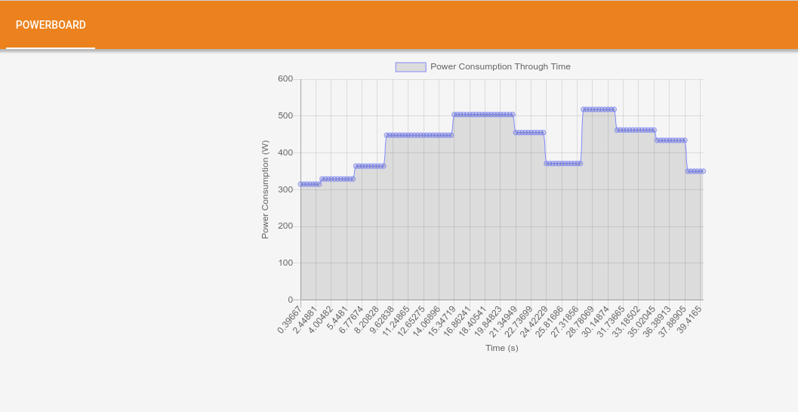
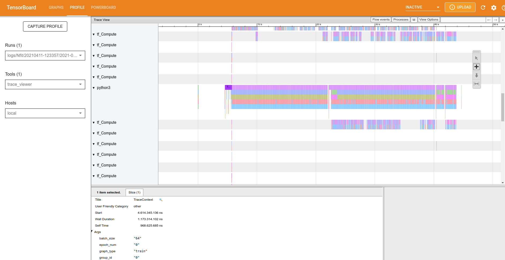
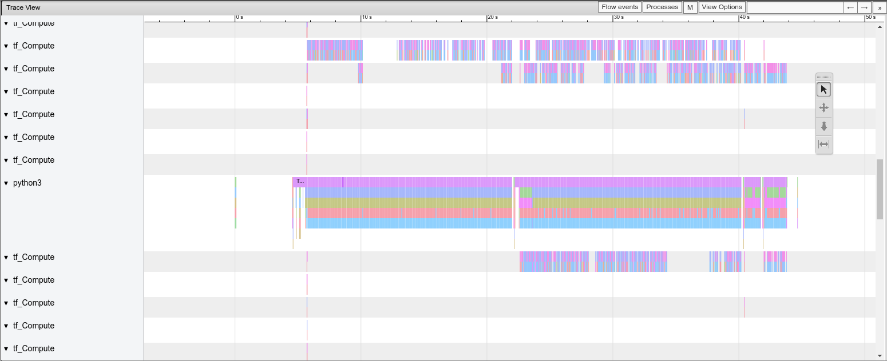
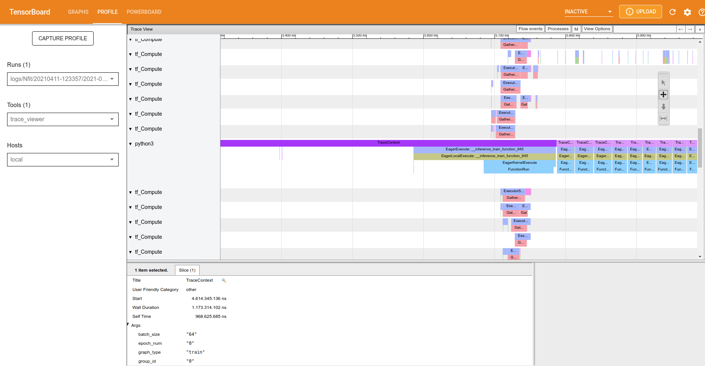
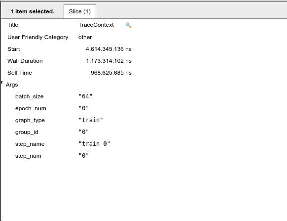
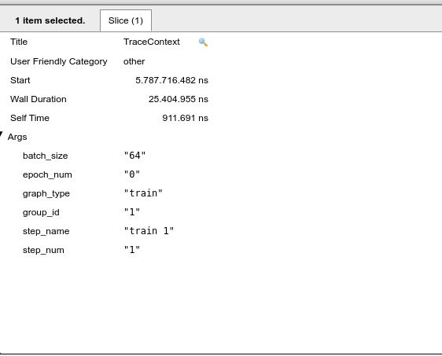
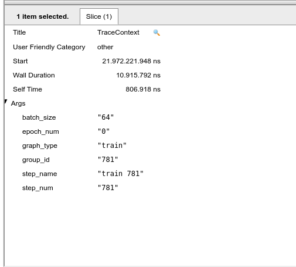

### Motivation

First we need to talk about the motivation behind this plugin. The architecture Power was designed for use in artificial intelligence and deep learning. Investigating tools for deep learning and machine learning we found TensorBoard. TensorBoard is a tool to view models which were created in TensorFlow, the TensorBoard is a toolkit that allows graphic visualization of your models, making it easier to understand the used model, debug bottlenecks and, as a result, optimize it. In this blog post, we’ll show how to use the plugin we’ve created, which adds a new feature to the TensorBoard, this plugin assists on debugging bottlenecks in conjunction with the trace-viewer.

### PowerBoard

PowerBoard is a plugin designed to show the power that is consumed while the neural network is trained, doing that  allows the trace-viewer a better understanding of the model and helps to debug the bottlenecks. 

Prerequisites: 

- Python 3.6 >=
- TensorFlow 2.2 >=
- TensorBoard 2.2 >=
- Pandas 1.2.1 >=
- ipmitool

  
> If you're having trouble installing tensorflow follow the link to a blog post that teaches you how to install tensorflow in the Power architecture:
> <https://openpower.ic.unicamp.br/post/profiling-using-tensorboard-profiler/>
> <https://openpower.ic.unicamp.br/post/installing-tensorflow-on-power/>

For the installation of PowerBoard Plugin acess the site  <https://pypi.org/project/powerboard/>, or use the following pip command:

```bash
pip install powerboard
```
Now you're able to use the powerboard. The powerboard possesses an implementation library called libipmi, which is responsible for accessing the low level register to obtain the power consumption. For this, do the following import:

```python
from powerboard import libipmi
``` 

#### libipmi:


* The function ```start() ``` : This function is responsible for measuring the power consumption and time of each aquisition. 
* The function ```stop() ``` : This function is responsible for stopping the aquisition of data. 
*  The function ```dbToCSV(<PATH>)```: The implementation of the function gets the data and saves it to a database, when the database is full the implementation saves all data in a csv file. For this, the argument PATH is the path to a directory were the data will be stored. My suggestion is to default the path to "./data" like this:
```python
libipmi.dbToCSV('./data')
```

Now you are able to test the plugin, for this I'll show an example of the code:
```python
from datetime import datetime
from packaging import version
import os
import tensorflow as tf
from powerboard import libipmi 


from tensorflow.keras import datasets, layers, models

stamp = datetime.now().strftime("%Y%m%d-%H%M%S")
logdir = 'logs/Nfit/%s' % stamp
writer = tf.summary.create_file_writer(logdir)
tf.summary.trace_on(profiler=True)

(train_images, train_labels), (test_images, test_labels) = datasets.cifar10.load_data()

# Normalize pixel values to be between 0 and 1
train_images, test_images = train_images / 255.0, test_images / 255.0


class_names = ['airplane', 'automobile', 'bird', 'cat', 'deer',
               'dog', 'frog', 'horse', 'ship', 'truck']


model = models.Sequential()
model.add(layers.Conv2D(32, (3, 3), activation='relu', input_shape=(32, 32, 3)))
model.add(layers.MaxPooling2D((2, 2)))
model.add(layers.Conv2D(64, (3, 3), activation='relu'))
model.add(layers.MaxPooling2D((2, 2)))
model.add(layers.Conv2D(64, (3, 3), activation='relu'))

model.summary()
model.add(layers.Flatten())
model.add(layers.Dense(64, activation='relu'))
model.add(layers.Dense(10))
model.summary()


model.compile(optimizer='adam',
              loss=tf.keras.losses.SparseCategoricalCrossentropy(from_logits=True),
              metrics=['accuracy'])


libipmi.start()
history = model.fit(train_images, train_labels, epochs=2,batch_size=64, 
                    validation_data=(test_images, test_labels))

test_loss, test_acc = model.evaluate(test_images,  test_labels, verbose=2)

libipmi.stop()
libipmi.dbToCSV('./data')


with writer.as_default():
  tf.summary.trace_export(
      name="convolution",
      step=0,
      profiler_outdir=logdir)

```
before you run the script let's make a directory in tmp files, so go to  ```/tmp``` by doing ``` cd /tmp``` and make a directory inside. I'll create the "teste" directory inside of tmp, as follows: 
```bash
cd /tmp
mkdir teste
```
Now go to the directory which the script was saved and run the script. Now copy the following directory into the ```/tmp/teste``` by doing:
```bash
cp -r demo_logs /tmp/teste
cp -r logs /tmp/teste
```
Now run the TensorBoard:
```bash
 tensorboard --logdir  /tmp/teste
 ```
Now let's have some fun by cracking our heads to understand the bottlenecks using the trace-viewer and powerboard tools.
the following image shows the powerboard.



> Figure 1: PowerBoard.

Now I'll show the trace-viewer overview.


> Figure 2: Trace-viewer overview.


Let's zoom in the image. You may control the graph by clicking in the button ```w``` to zoom in , ```s``` to zoom out, ```d``` to scroll right and ```e``` to scroll left.


> Figure 3: Trace-viewer zoom in.


The trace-viewer cracks, parallels and executes all operations in CPU and/or GPU to train our neural network. If you're using GPU the documentation of TensorBoard says "As a general rule of thumb, it is a good idea to always keep the device (GPU/TPU) active.
Use the tf.data API to optimize the input pipeline. In this case, let's cache the training dataset and prefetch the data to ensure that there is always data available for the GPU to process. See here for more details on using tf.data to optimize your input pipelines". In the trace-viewer we have the trace-context to aid in a better understanding of what is happening. 

> Go to: <https://www.tensorflow.org/tensorboard/tensorboard_profiling_keras> for a complete documentation.



> Figure 4: Trace-viewer: trace context.


Click on the first occurrence of the traceContext and look at 'slice', this part of the trace viewer shows all the arguments of the function, such as the time spent on this function.


> Figure 5: Trace context: inside of slice.


Note that we are at the epoch number "0" and step_name "0", that is, in this part of the x-axis the graph indicates the first image to train our neural network. If we proceed to the next trace context it will follow to the next images to be trained. When the epoch value changes to 1 it means that we have finished training our neural network for the first time, and a new epoch will begin. Note that the size of the set of images is selected by the batch_size slice of our code, that is, we take the total number of images from the dataset and divide them by batch_size, in general the batch_size are powers of 2.


> Figure 6: Trace context: the next interation.

Now the next part is understanding the power consumption and relationships with the code. For this the following image shows the last interation of 1 complete epoch:



> Figure 7: Trace context: the last interation of epoch 0.

Note that a full epoch takes about 22 seconds, as shown by the powerboard tab. Symmetry in the graph is expected, but it does not occur. Also note that between times 27.31 s and 28.78 s we have a sudden increase in power, so we will go in the trace-viewer to look at what is being carried out during this interval. In the meantime, we note that there is the following set of images from the training in epoch 1 [185-258]. Returning this set to epoch 0 it corresponds to the time interval between 9.35 s and 11.13 s. 
It is possible to conclude that theoretically the epochs should be symmetrical in terms of operations, that is, the energy expenditure should be the same, but it is noticed that something beyond the code is supplying this increase in extra power consumption by the same part of operations. Perhaps a new approach at a lower level would be needed to reach better conclusions.

