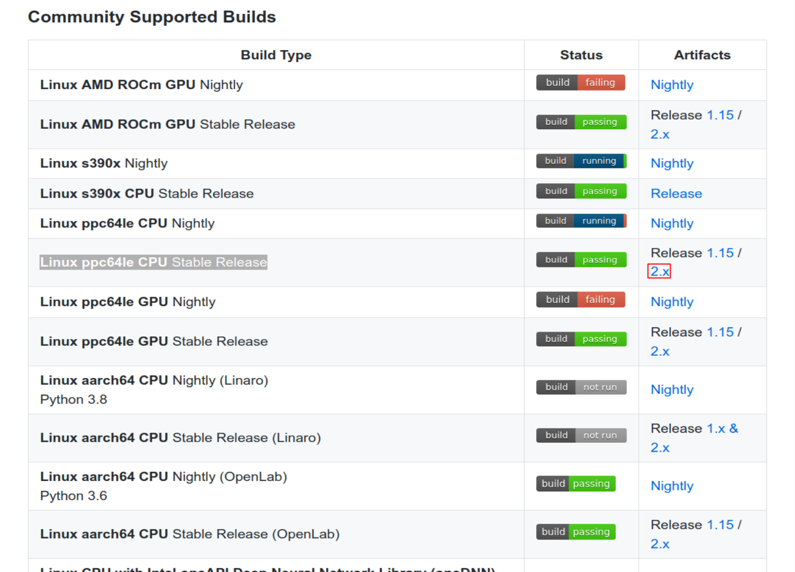
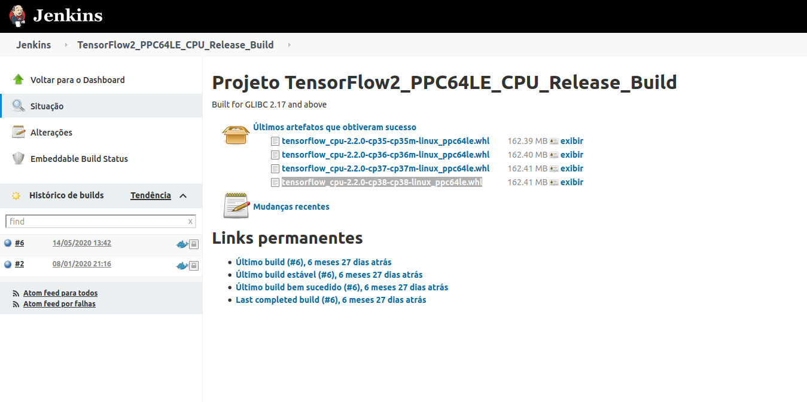

This blog post will show how to install tensorflow 2.2 in POWER, how to use profiler and make a comparison between different architectures ( x86, POWER 8 and 9).

# Prerequisites
In this part I'll show how to setup your Virtual Machine (VM) and install tensorflow 2.2 in POWER. My PIP version is 20.3 and my version of python is 3.8.

First we need to install some libraries to install tensorflow 2.2.

Installing dependecies of scipy:
```shell
    sudo apt-get install libblas-dev liblapack-dev libatlas-base-dev gfortran
``` 
Installing h5py:
```shell
    sudo apt install python3-h5py  
``` 
Installing keras using pip:
```shell
    pip3 install -U --user keras_applications --no-deps
    pip3 install -U --user keras_preprocessing --no-deps
  
``` 

Now we are able to install tensorflow 2.2. For this, access the site (https://github.com/tensorflow/tensorflow) to download .whl file (this file is used to install tensorflow using pip comand). First go in Community Supported Builds Section, and click in Artifacts release 2.x of Linux ppc64le CPU Stable Release. 


> Figure 1: Tensorflow 2.2 cpu- only installation.

After clicking we are directed to jenkins, where we click in tensorflow_cpu-2.2.0-cp38-cp38-linux_ppc64le.whl. Note that "cp38" indicates that the tensorflow should be installed in python 3.8. However, if you are using different versions of python you can download the version corresponding to your python version. But in this tutorial I'll show how to setup using python 3.8.


> Figure 2: Download .whl tensorflow 2.2 build.

For download in VM, copy the link (tensorflow_cpu-2.2.0-cp38-cp38-linux_ppc64le.whl) and use the command below:

```shell
    wget https://powerci.osuosl.org/job/TensorFlow2_PPC64LE_CPU_Release_Build/lastSuccessfulBuild/artifact/tensorflow_pkg/tensorflow_cpu-2.2.0-cp38-cp38-linux_ppc64le.whl  
``` 

Now for installation of the tensorflow using pip command:

```shell
    pip3 install tensorflow_cpu-2.2.0-cp38-cp38-linux_ppc64le.whl  
``` 
For more information you can visit https://www.tensorflow.org/install/source.

Now we need to install tensorboard, tensorboard-plugin-profiler and tensorflow-datasets.
```shell
    pip3 install --upgrade tensorboard
    pip3 install tensorflow-datasets
    pip3 install -U tensorboard_plugin_profile
``` 

## Get access to POWER 8 VM in minicloud
Here is a brief tutorial on how to access POWER 8 virtual machine in minicloud, first access https://openpower.ic.unicamp.br/minicloud/ and click in **Request Access**  and answer the google forms to get access. Here is a link that may help you to get access to an instance on minicloud https://github.com/Unicamp-OpenPower/minicloud/wiki. In the next section I'll show to access tensorboard by terminal.

## SSH connection

You'll need to connect to VM via ssh using the `-L 6006:localhost:6006` flag. To be able to use tensorboard in the terminal, your command should be like this:

`ssh ubuntu@minicloud.parqtec.unicamp.br -i ~/.ssh/your-key.pem -p <vm-port> -L 6006:localhost:6006`

For using tensorboard in the terminal we use this command:
```shell
    tensorboard --logdir=<name_of_log_directory>
``` 
Now we are able to open the link in your favorite browser.


## Compare Tensorboard-Profiler in different architectures

In this section, we will be profiling using Tensorboard-Profiler in different architectures and showing the results. First, we will standardize the test file. For this, download the file available in https://www.tensorflow.org/tensorboard/tensorboard_profiling_keras and modify the line: 
```
model.fit(ds_train,
          epochs=2,
          validation_data=ds_test,
          callbacks = [tboard_callback])
```
to:
```
model.fit(ds_train,
          epochs=5,
          validation_data=ds_test,
          callbacks = [tboard_callback])
```

 Now we are ready to execute the script and debug performance bottlenecks using Tensorboard-Profiler.

>Sometimes when running Tensorflow we get some errors like: AttributeError: partially initialized module 'tensorflow' has no attribute '__version__' (most likely due to a circular import). To fix this error you can use the flag -m.
```shell
    python3 -m <your-python-file>
``` 

After running the script in different architectures we obtain the following results:


**Input pipeline analyzer:**


* Data preprocessing (ms)

Table 1: Data preprocessing in different architectures

| X86      |     POWER8    | POWER9 |
|----------|:-------------:|------: |
| 390      |  180          | 164    |


* Reading data from files in advance (including caching, prefetching, interleaving) (in ms):

Table 2: Reading data from files in advance in different architectures

| X86      |     POWER8    | POWER9 |
|----------|:-------------:|------: |
| 6.7      |  ~ 0        | ~0   |


**Tensorflow stats:**

* Operations which consume more time:

Table 3: Operations which consume more time in x86

| Type    |     Operation    | Occurrences | total time (us) |
|----------|:-------------:|-------------: |  -------------:|
| 	Dataset  | Iterator::Model::MapAndBatch | 21   |112,868|
| 	Dataset  | Iterator::Model::MapAndBatch::Prefetch::ParallelMap| 2.907   |106,162|
| 	Dataset  | Iterator::Model::MapAndBatch::Prefetch::ParallelMap::ParallelMap |2.907   |104,103|
| 	Decode Png |  decode_image/cond_jpeg/else/_1/cond_png/then/_0/DecodePng | 2.910   |79,162|

Table 4: Operations which consume more time in POWER8

| Type    |     Operation    | Occurrences | total time (us)      |
|----------|:-------------:|-------------: |  -----------------:|
| 	Dataset  |   Iterator::Model::MapAndBatch | 21   |131,659|
| 	Dataset  |   Iterator::Model::MapAndBatch::Prefetch::ParallelMap| 2.673   |23,513|
| 	MatMul  |   gradient_tape/sequential/dense/MatMul |21  |16,335|
| 	Dataset  |  Iterator::Model::MapAndBatch::Prefetch | 2.673   |15,375|


Table 5: Operations which consume more time in POWER9

| Type    |     Operation    | Occurrences | total time (us) |
|----------|:-------------:|-------------: |  -------------:|
| 	Dataset  |   Iterator::Model::MapAndBatch | 21   |114,562|
| 	_FusedMatMul  |   sequential/dense/Relu| 21   |30,306|
| 	Dataset  |   Iterator::Model::MapAndBatch::Prefetch::ParallelMap |2.676   |20,957|
| 	Dataset  |  Iterator::Model::MapAndBatch::Prefetch | 2.675   |16,722|


Now we can analyze the dada and compare beteween different architectures. First we note that x86 consumes more time for data preprocessing and reading data from files in advance (Tables 1 and 2). In Tensorflow stats we can crack the entire code in operations but I'll show only the top 4 time-consuming operations in tables 3, 4 and 5. However, you can get all operations in tensorboard-profiler in section Tensorflow Stats. 
From tables 3, 4 and 5 we obtain that the type of operation differs a little, for example in table 3 we have Decode Png in top 4, whereas in power architectures (Tables 4 and 5) we have matmul. But in all 3 architectures Dataset is highly time-consuming.

An interesting function in tensorboard-profiler is **Recommendation for Next Step**. This function highlights some otimizations that could improve your program, for exemple, when I execute my program in POWER 8 we have some recommendations like:

* Your program is HIGHLY input-bound because 68.8% of the total step time sampled is waiting for input. Therefore, you should first focus on reducing the input time
* 7.3 % of the total step time sampled is spent on All Others time.

Next tools to use for reducing the input time

* input_pipeline_analyzer (especially Section 3 for the breakdown of input operations on the Host)
* trace_viewer (look at the activities on the timeline of each Host Thread near the bottom of the trace view) 


